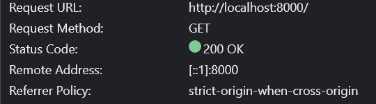
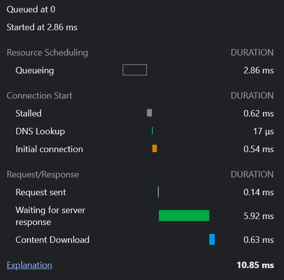
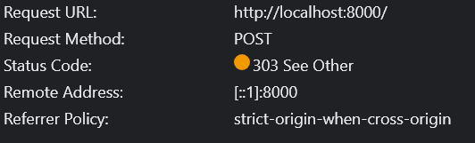
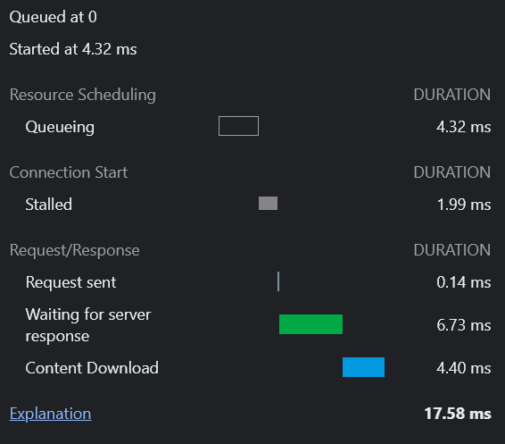

# Praktikum 2 - TCP Sockets und HTTP 
## **Funktionale Test**
Funktionale Test machen wir durch draufschauen:
- GET Requeste kommt bei der entsprechenden Bank an
   - Daten im Browser werden nach jedem GET aktualisiert
   - GET wird abgeschickt, wenn das Fenster neugeladen wird
- POST Request kommt bei der entsprechenden Bank an 
   - Daten im Browser werden nach jedem POST aktualisiert
   - Man sieht die Änderung der Daten auch bei den UDP updates

## **Nicht-funktionale Test**
- Wir messen die Performance der GET und POST Requests in unserem Browser 

## **Messprotokoll**
### GET Request:

### POST Request:

### Nachrichtendurchsatz bei der Börse (gesendet):
| Sekunden | Nachichten Insgesamt | Nachichten per Second |
| -------- |----------------------|-----------------------|
|   10  | 4178                 | 417.72 msg/s          |

### Nachrichtendurchsatz bei der Bank (empfangen):
| Bank   | Sekunden | Nachichten Insgesamt | Nachichten per Second |
|--------| -------- |----------------------|-----------------------|
| bank 1 |   10  | 4542                 | 454.1 msg/s           |
| bank 2 |   10  | 4455                 | 445.41 msg/s          |
| bank 3 |   10  | 4685                 | 468.5 msg/s           |
| bank 4 |   10  | 4709                 | 470.8 msg/s           |
