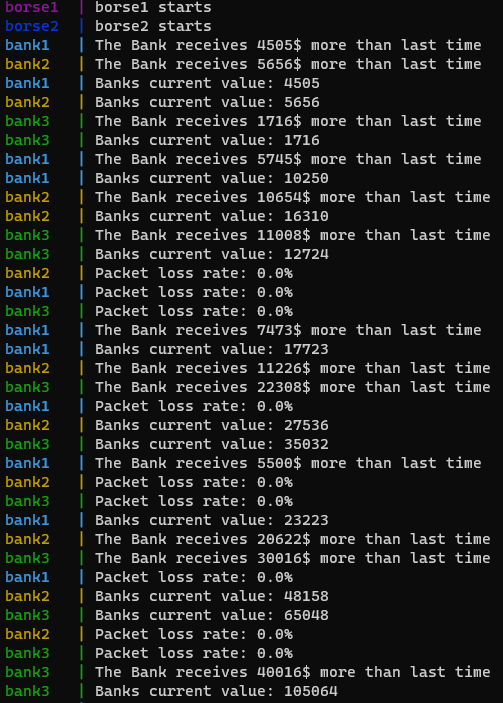
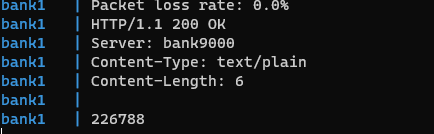
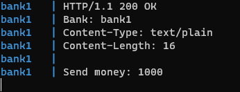
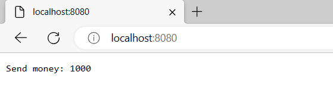
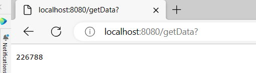
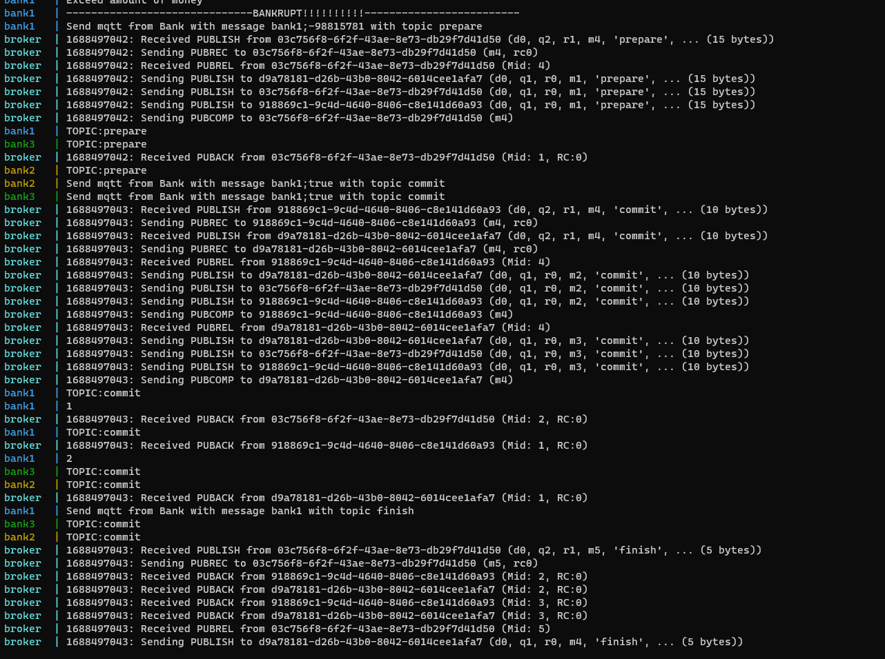
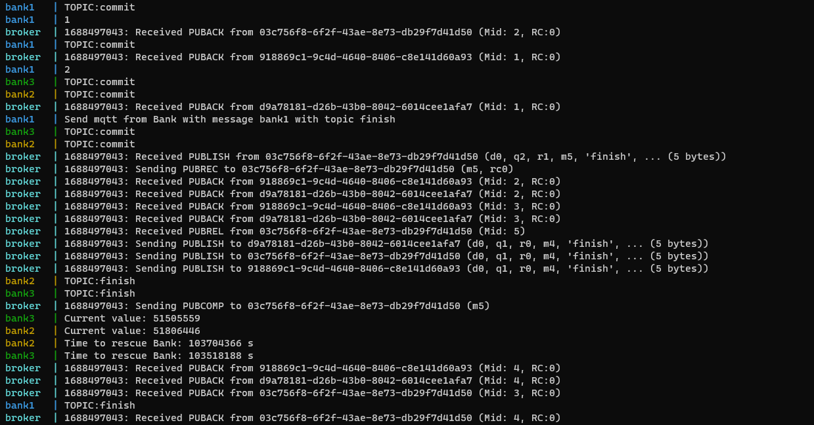
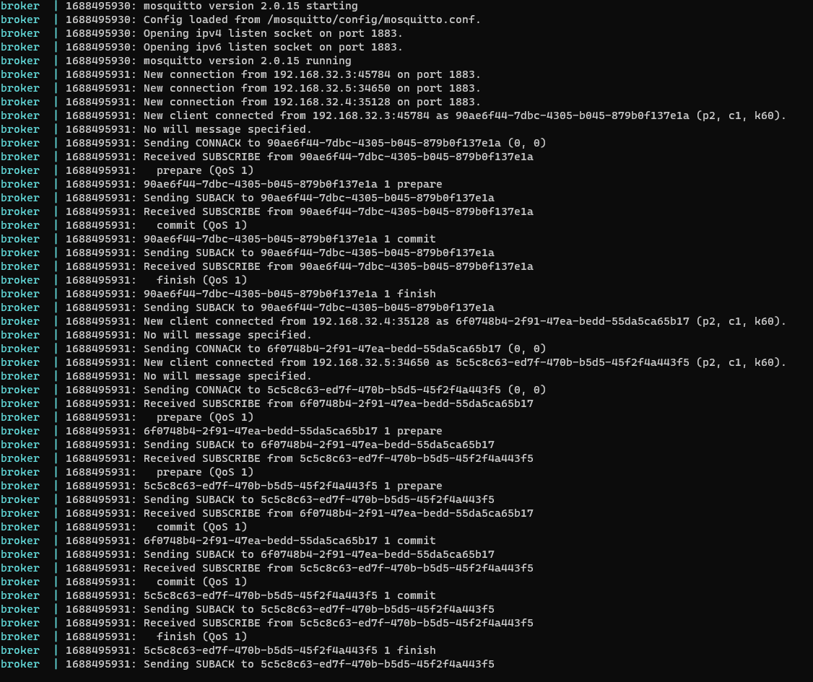
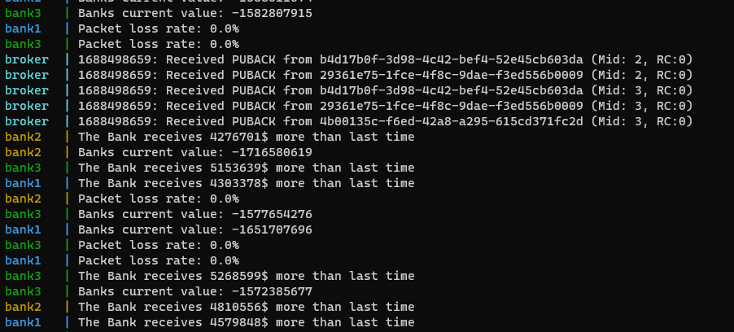

# Verteilte Systeme
## **Ablaufbeschreibung vom Praktikum**
Dokumentation: 

- Wir haben das Praktikum wie bereits erwähnt mit Python und Java gemacht, Python allerdings nur bis Praktikum 3 problemlos geschafft, das Programm und die Dokumentation für Praktikum1-3 sind auf unserem Branch "Praktikum_1,2_Sanjeev_Mina" zu finden.

- Da wir eine Dreier Gruppe waren, hatten wir parallel zwei Codes geschrieben und weil wir das vierte Praktikum nur mit Java rechtzeitig ohne Bugs geschafft haben, hat Minh das vierte Praktikum mit Java Ihnen vorgestellt im Praktikum und diese Datei wurde dann ebenfalls auf GIT auf die Main Branch gepushed. Allerdings haben wir die 1-3 Dokumentation auch noch auf die Main Branch gepushed und werden dann alles separat auf Moodle als PDF hochladen.

- Und im Folgenden sehen Sie noch die Screenshots für das vierte Praktikum, was wir ebenfalls als  PDF noch hochladen werden.

# Aufgabe 1 UDP 

# Aufgabe 2 HTTP mit POST und GET 

# Aufgabe 3 RPC 

# Aufgabe 4 MQTT 

Initial 

